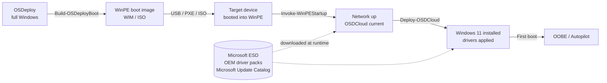

# Overview: When and Why to Use OSDCloud

## When to use OSDCloud

OSDCloud is the right tool when **all** of these are true:

- You need to install Windows 11 on a bare-metal or wiped device.
- The device has internet access while booted into WinPE.
- You want to avoid hosting an OS image server, distribution point, or task sequence infrastructure.
- You want the latest Windows ESD from Microsoft and OEM drivers from Dell / HP / Lenovo / Microsoft / Panasonic applied automatically.

Typical scenarios:

| Scenario | Fits OSDCloud? |
|---|---|
| Re-image a single broken laptop in a branch office | **Yes** — boot from USB, deploy, done. |
| Bulk re-image a lab of 30 PCs | **Yes** — one USB stick or PXE image, repeat. |
| Provision a new PC for Autopilot enrolment | **Yes** — deploy Windows, hand off to OOBE. See [guide 8](08-autopilot-oobe.md). |
| Deploy a custom corporate gold image | **No** — OSDCloud uses Microsoft ESDs. Use MDT/ConfigMgr or build a custom WIM. |
| Air-gapped network (no internet) | **No** — OSDCloud downloads ESDs and driver packs at runtime. |
| Deploy Windows 10 | **No** — current workflows target Windows 11 (25H2/24H2/23H2). |

## Why use OSDCloud

| | OSDCloud | MDT | ConfigMgr | Autopilot (alone) |
|---|---|---|---|---|
| Infrastructure required | None | Deployment share + WDS | Site server + DP | None |
| Bare-metal install | Yes | Yes | Yes | No (needs OS preinstalled) |
| Image source | Microsoft ESD (live) | Custom WIM | Custom WIM | OEM factory image |
| Driver source | OEM driver pack (live) | Manual import | Manual import | OEM |
| Re-image broken PC | Boot from USB | Needs network share | Needs site access | Not supported |
| Best for | Cloud-first, low-infra teams | On-prem image control | Large managed estates | New devices |

OSDCloud removes the "I need a deployment server" requirement. The boot
image plus an internet connection is the entire dependency.

## What OSDCloud is (and isn't)

OSDCloud is a **PowerShell module** that runs **inside WinPE** and:

1. Validates the target hardware.
2. Wipes and partitions the local disk (UEFI / GPT).
3. Downloads a Windows 11 ESD from Microsoft.
4. Applies the image, writes BCD, and injects firmware + OEM + Microsoft Update drivers.
5. Stages PowerShell modules and OOBE customizations for first boot.

OSDCloud does **not**:

- Create the WinPE boot image — that's [OSDeploy](02-build-boot-image.md).
- Enrol devices in Intune / Autopilot directly — that happens at OOBE. See [guide 8](08-autopilot-oobe.md).
- Replace ConfigMgr or MDT for managed-estate task sequences — it complements them.

## Architecture in one picture

## Next

- [Build a WinPE boot image](02-build-boot-image.md)
- [Deploy Windows 11 end-to-end](04-deploy-windows.md)
