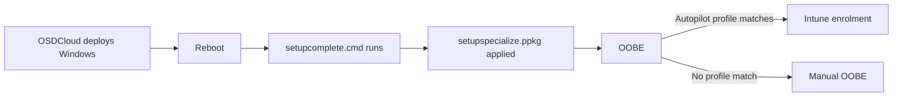

# Hand Off to Autopilot and OOBE

## When to use this

You want the deployed device to land **at OOBE ready for Intune /
Autopilot enrolment**, rather than at a workgroup-joined desktop. This is
the standard pattern for handing a freshly imaged device to an end user.

## Why this works

OSDCloud installs Windows but does not run OOBE — OOBE runs on the first
boot from disk. That gap is the natural integration point for Autopilot:



Autopilot enrolment requires the device's hardware hash to be uploaded to
Intune **before** OOBE. There are two common paths:

1. **Pre-registered devices** — vendor uploaded the hash at purchase. Just deploy and let OOBE find the profile.
2. **Self-registration** — deploy with a script that collects the hash and uploads it during the staging window. The `WindowsAutopilotIntune` and Microsoft Graph modules support this.

## Prerequisites

- An Intune tenant with an Autopilot deployment profile assigned.
- For self-registration: an app registration with the
  `DeviceManagementServiceConfig.ReadWrite.All` Graph permission.

## How OSDCloud sets up the handoff

Two pieces ship in the OSDCloud module:

| File | Role |
|---|---|
| `OSDCloud/core/setupspecialize/setupspecialize.ppkg` | Provisioning package applied at `Specialize` to set OOBE registry values |
| `OSDCloud/core/setupspecialize/setupspecialize.xml` | Source XML the PPKG was built from — edit this and rebuild the PPKG to customize |
| `OSDCloud/core/setupspecialize/customizations.xml` | Additional WCM customizations |

The OEM driver pack staging step (step 24) also writes commands into
`C:\Windows\Setup\Scripts\setupcomplete.cmd` so OEM drivers install
during Specialize without blocking OOBE.

## How to enable Autopilot-related modules on the deployed image

Steps 33–37 in the workflow stage PowerShell modules onto the offline
image so they are available at first boot. They ship with `"skip": true`.
Turn them on in `workflow/default/tasks/osdcloud.json` for the channel you use:

```jsonc
{ "name": "Save PowerShell Module WindowsAutopilotIntune",           "command": "step-powershell-savemodule", "parameters": { "name": "WindowsAutopilotIntune" },           "skip": false },
{ "name": "Save PowerShell Module Microsoft.Graph.Authentication",   "command": "step-powershell-savemodule", "parameters": { "name": "Microsoft.Graph.Authentication" },   "skip": false },
{ "name": "Save PowerShell Module Microsoft.Graph.Identity.DirectoryManagement", "command": "step-powershell-savemodule", "parameters": { "name": "Microsoft.Graph.Identity.DirectoryManagement" }, "skip": false },
{ "name": "Save PowerShell Module Microsoft.Graph.Groups",           "command": "step-powershell-savemodule", "parameters": { "name": "Microsoft.Graph.Groups" },           "skip": false }
```

After deployment those modules are in `C:\Program Files\WindowsPowerShell\Modules\`
and `Get-AutopilotInfo` is callable from a first-boot script.

## Pattern A — pre-registered device

1. Vendor (or your purchasing process) uploaded the hardware hash to Intune.
2. Deploy with OSDCloud normally:
   ```powershell
   Deploy-OSDCloud
   ```
3. Reboot.
4. OOBE starts → detects the matching Autopilot profile → enrols silently.

No extra customization is required.

## Pattern B — collect and upload hash from WinPE

Add a step to your main command (in a USB profile — see
[guide 6](06-unattended-usb-profile.md)) that runs after the deployment:

```jsonc
{
  "InvokeMainCommand": [
    "Show-OSDCloudDeviceInfo",
    "Deploy-OSDCloud -CLI",
    "https://raw.githubusercontent.com/contoso/autopilot/main/Register-DeviceWithIntune.ps1"
  ]
}
```

The registration script (your own) authenticates to Graph, calls
`Get-AutopilotInfo`, and posts to
`/deviceManagement/importedWindowsAutopilotDeviceIdentities`. After upload,
reboot — OOBE finds the profile.

## Pattern C — manual OOBE, no Autopilot

Just deploy. OOBE walks the operator through region, keyboard, network,
account. No additional configuration is needed.

## Customize OOBE settings

Edit the source XML, rebuild the PPKG with the Windows Configuration Designer,
and replace `OSDCloud/core/setupspecialize/setupspecialize.ppkg`. Common
edits:

- Skip the EULA page (the `Hotfix for Setup Displayed Eula` workflow step already sets `SetupDisplayedEula = 1` so this is normally handled).
- Set a default keyboard or time zone before OOBE shows.
- Disable Cortana / privacy pages for kiosk scenarios.

## What this guide is **not**

A complete Autopilot setup guide. For Intune profile creation, assignment
groups, and ESP behaviour see:

- [Microsoft Learn — Windows Autopilot deployment](https://learn.microsoft.com/autopilot/)
- [Microsoft Learn — Enrolment Status Page](https://learn.microsoft.com/autopilot/enrollment-status)

## Next

- [Troubleshoot](09-troubleshooting.md) if the device lands at OOBE without joining Intune.
